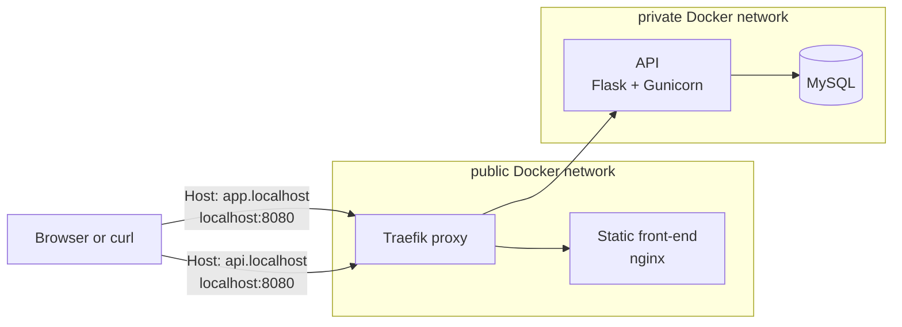
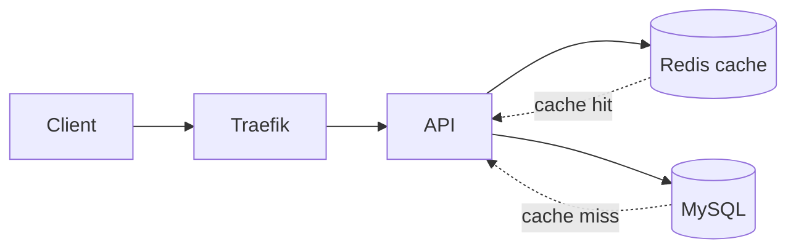

# 01 - Network segmentation

This stage separates public and private traffic.

- `public` network: Traefik and the front-end.
- `private` network: API and MySQL.
- Traefik joins both networks and becomes the only bridge from public traffic to the API.
- The API and MySQL publish no host ports.

## Current architecture



## What this proves

- Public traffic enters only through Traefik.
- MySQL is reachable from the API network, not from the laptop.
- API and database containers are isolated from the public Docker network.

## Run

```bash
docker compose up -d --build --wait
```

## Prove it

Run the automated check:

```bash
./scripts/check.sh
```

Manual proof commands:

```bash
# Front-end through the proxy.
curl -H 'Host: app.localhost' http://localhost:8080/

# API through the proxy.
curl -H 'Host: api.localhost' http://localhost:8080/api/items

# Traefik dashboard API is available only on the local lab port.
curl http://localhost:8081/api/rawdata

# These should not contain HostPort entries.
docker inspect "$(docker compose ps -q api)" --format '{{json .NetworkSettings.Ports}}'
docker inspect "$(docker compose ps -q mysql)" --format '{{json .NetworkSettings.Ports}}'

# API and MySQL should only show the private network.
docker inspect "$(docker compose ps -q api)" --format '{{json .NetworkSettings.Networks}}'
docker inspect "$(docker compose ps -q mysql)" --format '{{json .NetworkSettings.Networks}}'
```

## Next stage preview



Stage 02 keeps the network isolation and adds Redis on the private network so repeated API reads do not always hit MySQL.

## Stop

```bash
docker compose down -v
```

`-v` removes the teaching database volume so the next run starts clean.
