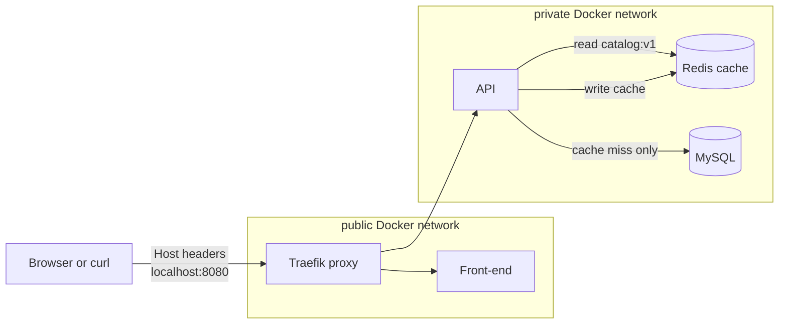
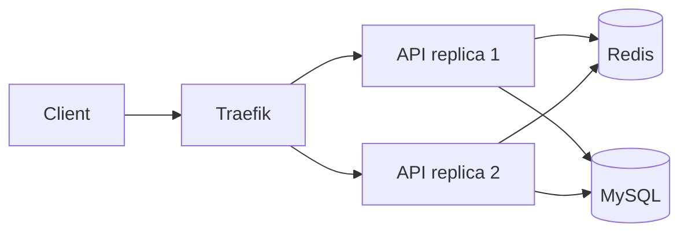

# 02 - Redis caching

This stage adds Redis on the private network.

- Redis is not exposed to the laptop.
- The API checks Redis first.
- MySQL is used only on a cache miss.
- `/api/cache/clear` exists so the cache behavior is easy to demonstrate.

## Current architecture



## What this proves

- Redis is a private dependency, not a public service.
- The same API endpoint can return from MySQL first and Redis second.
- Cache invalidation is explicit through a teaching endpoint.

## Run

```bash
docker compose up -d --build --wait
```

## Prove it

Run the automated check:

```bash
./scripts/check.sh
```

Manual cache proof:

```bash
# Clear the cache.
curl -X POST -H 'Host: api.localhost' http://localhost:8080/api/cache/clear

# First read should include "source":"mysql".
curl -H 'Host: api.localhost' http://localhost:8080/api/items

# Second read should include "source":"redis-cache".
curl -H 'Host: api.localhost' http://localhost:8080/api/items

# Redis should now contain at least one key.
docker compose exec redis redis-cli DBSIZE

# Redis should not contain HostPort entries.
docker inspect "$(docker compose ps -q redis)" --format '{{json .NetworkSettings.Ports}}'
```

## Next stage preview



Stage 03 keeps Redis and MySQL, then runs two API replicas behind Traefik to demonstrate load balancing.

## Stop

```bash
docker compose down -v
```
