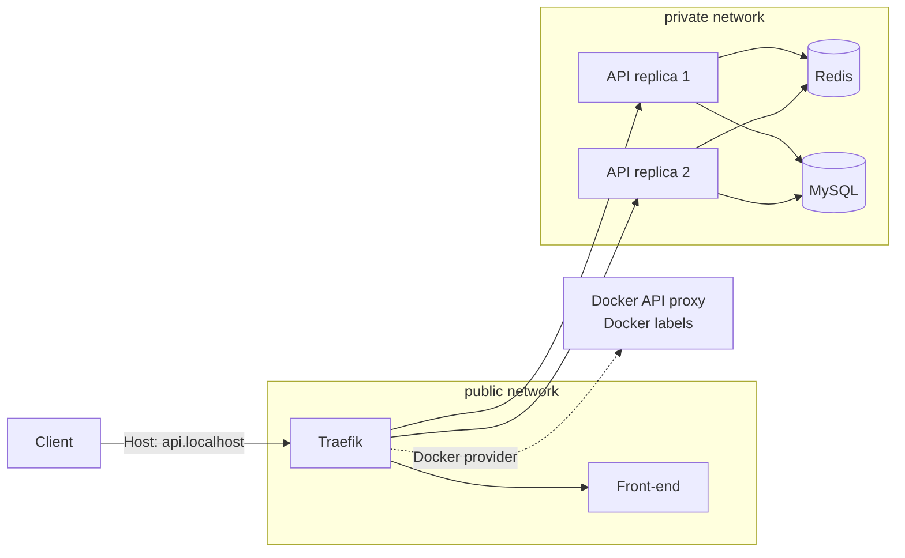
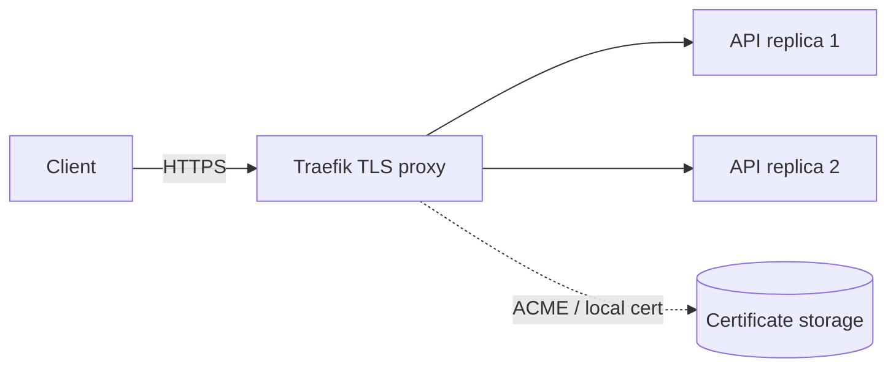

# 03 - Backend load balancing

This stage runs two API replicas behind Traefik.

- Redis and MySQL remain private.
- Traefik forwards API traffic to both API containers.
- Each API response includes the container `hostname`, so distribution is visible.
- The Compose project name is fixed, so the Docker provider service discovery is deterministic for this lab.

## Current architecture



## What this proves

- The API can be horizontally scaled with `--scale api=2`.
- Traefik distributes requests across both API replicas.
- Stateful dependencies stay private and shared.

## Run

```bash
docker compose up -d --build --scale api=2 --wait
```

## Prove it

Run the automated check:

```bash
./scripts/check.sh
```
Traefik discovery proof:

```bash
curl http://localhost:8081/api/http/routers | grep '@docker'
docker compose exec traefik wget -q -O - http://docker-api-proxy:2375/v1.24/version
```


Manual load-balancing proof:

```bash
# Confirm two API containers exist.
docker compose ps api

# Send repeated requests and compare the hostname values.
for i in 1 2 3 4 5 6 7 8 9 10; do
  curl -s -H 'Host: api.localhost' http://localhost:8080/api/items | sed -n 's/.*"hostname":"\([^"]*\)".*/\1/p'
done

# Traefik should expose the Docker-provider API service.
curl http://localhost:8081/api/http/services | grep backend-api@docker
```

Dashboard:

```bash
open http://localhost:8081/dashboard/
```

## Next stage preview



Stage 04 upgrades the proxy to HTTPS, adds local TLS for the laptop, and includes an ACME overlay for real domains.

## Stop

```bash
docker compose down -v
```
