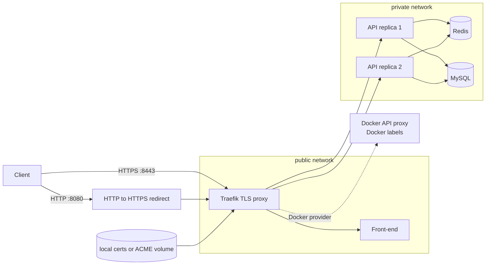
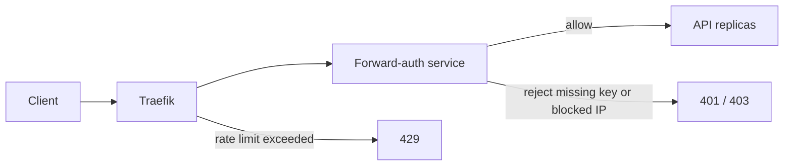

# 04 - SSL-enabled proxy

This stage upgrades Traefik to HTTPS.

Local laptop mode:

- Uses a generated self-signed certificate.
- Listens on `https://localhost:8443`.
- Redirects HTTP on `localhost:8080` to HTTPS.

Production domain mode:

- Traefik has an ACME resolver named `letsencrypt`.
- `compose.acme.yml` adds Docker labels that attach the `letsencrypt` resolver to the HTTPS routers.
- ACME state is stored in the `letsencrypt` volume, which lets Traefik renew certificates automatically.

## Current architecture



## What this proves

- Web and API traffic can be terminated at a TLS-enabled proxy.
- HTTP requests are redirected to HTTPS.
- The same stack supports local self-signed certificates and production ACME routing.

## Run locally

```bash
./scripts/generate-local-certs.sh
docker compose up -d --build --scale api=2 --wait
```

## Prove it locally

Run the automated check:

```bash
./scripts/check.sh
```
Traefik discovery proof:

```bash
curl http://localhost:8081/api/http/routers | grep '@docker'
docker compose exec traefik wget -q -O - http://docker-api-proxy:2375/v1.24/version
```


Manual TLS proof:

```bash
# Front-end over HTTPS.
curl -k -H 'Host: app.localhost' https://localhost:8443/

# API over HTTPS.
curl -k -H 'Host: api.localhost' https://localhost:8443/api/items

# HTTP should redirect to HTTPS.
curl -i -H 'Host: app.localhost' http://localhost:8080/

# Inspect the local certificate subject.
openssl x509 -in certs/local.crt -noout -subject -issuer -dates

# The ACME overlay must render as valid Compose config.
docker compose -f compose.yml -f compose.acme.yml config -q
```

## Production ACME example

Set real DNS first. Edit the `Host(...)` values in the `front` and `api` Traefik labels in `compose.yml`, then run:

```bash
export ACME_EMAIL=ops@example.com
docker compose -f compose.yml -f compose.acme.yml up -d --build --scale api=2
```

For real ACME HTTP-01 validation, public ports `80` and `443` must reach this Docker host.

## Next stage preview



Stage 05 keeps HTTPS and adds the proxy security layer: API key validation, IP blocking, rate limiting, and security headers.

## Stop

```bash
docker compose down -v
```
