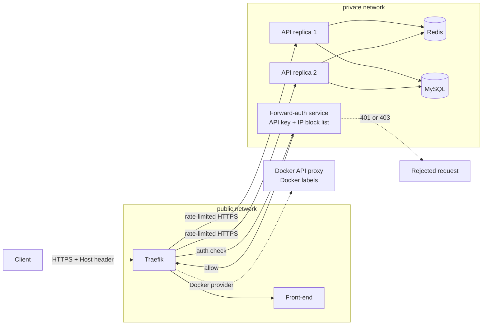
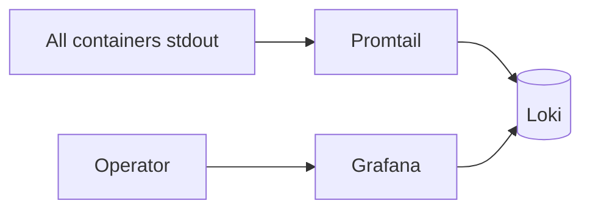

# 05 - API security layer

This stage adds security controls at the proxy layer.

Implemented controls:

- API key validation with Traefik `forwardAuth`.
- IP block list checked before the API receives traffic.
- Rate limiting per source IP.
- Security headers such as HSTS and `X-Content-Type-Options`.
- HTTPS remains enabled from the previous stage.

The API itself still has no public port. Clients must pass through Traefik.

## Current architecture



## What this proves

- Requests without the API key are rejected with `401`.
- Requests from a blocked demo IP are rejected with `403`.
- Bursty traffic receives `429` from Traefik before it reaches the API.
- Security headers are applied by the proxy.

## Run

```bash
./scripts/generate-local-certs.sh
docker compose up -d --build --scale api=2 --wait
```

## Prove it

Run the automated check:

```bash
./scripts/check.sh
```
Traefik discovery proof:

```bash
curl http://localhost:8081/api/http/routers | grep '@docker'
docker compose exec traefik wget -q -O - http://docker-api-proxy:2375/v1.24/version
```


Manual security proof:

```bash
# Rejected: no API key.
curl -k -i -H 'Host: api.localhost' https://localhost:8443/api/items

# Accepted: valid API key.
curl -k -H 'Host: api.localhost' \
  -H 'X-API-Key: lab-secret-key' \
  https://localhost:8443/api/items

# Rejected: blocked source IP demonstration.
curl -k -i -H 'Host: api.localhost' \
  -H 'X-API-Key: lab-secret-key' \
  -H 'X-Forwarded-For: 203.0.113.10' \
  https://localhost:8443/api/items

# Prove security headers are present.
curl -k -I -H 'Host: api.localhost' \
  -H 'X-API-Key: lab-secret-key' \
  https://localhost:8443/api/items

# Prove rate limiting by sending a burst.
for i in $(seq 1 25); do
  curl -k -s -o /dev/null -w "%{http_code}\n" \
    -H 'Host: api.localhost' \
    -H 'X-API-Key: lab-secret-key' \
    https://localhost:8443/api/items
done | sort | uniq -c

# Inspect loaded Traefik middlewares.
curl http://localhost:8081/api/http/middlewares
```

## Next stage preview



Stage 06 keeps the security layer and adds centralized logging with Loki, Promtail, and Grafana.

## Stop

```bash
docker compose down -v
```
