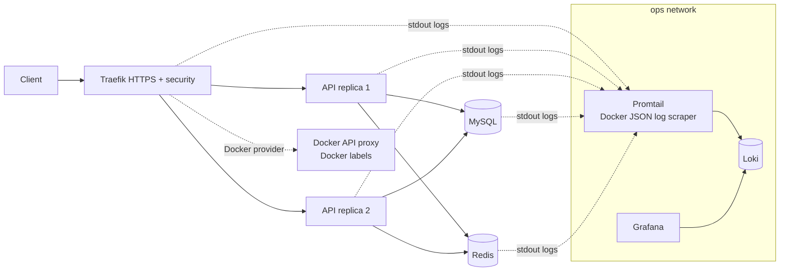
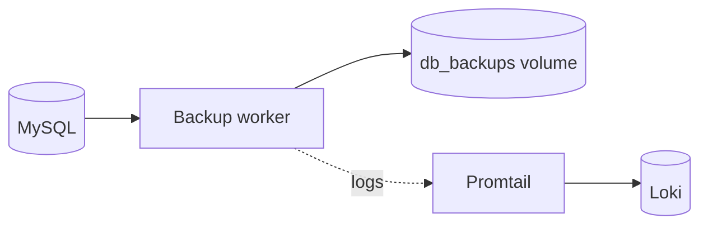

# 06 - Centralized logging

This stage adds central logging.

Components:

- Loki stores logs.
- Promtail scrapes Docker JSON log files and labels them with this Compose project.
- Grafana is preconfigured with Loki as a datasource.
- The HTTPS proxy and API security controls remain active.

Why Loki:

- It is lightweight for Docker Compose labs.
- It indexes labels instead of full log text, so it is cheaper to run than full-text indexing systems.
- It integrates directly with Grafana.

## Current architecture



## What this proves

- Logs are collected centrally instead of being inspected one container at a time.
- Grafana can query Loki without manual datasource setup.
- Application traffic still passes through HTTPS, API key checks, IP blocking, and rate limiting.

## Run

```bash
./scripts/generate-local-certs.sh
docker compose up -d --build --scale api=2 --wait
```

## Prove it

Run the automated check:

```bash
./scripts/check.sh
```
Traefik discovery proof:

```bash
curl http://localhost:8081/api/http/routers | grep '@docker'
docker compose exec traefik wget -q -O - http://docker-api-proxy:2375/v1.24/version
```


Manual logging proof:

```bash
# Generate API logs.
curl -k -H 'Host: api.localhost' \
  -H 'X-API-Key: lab-secret-key' \
  https://localhost:8443/api/items

# Loki should have a series for this Compose project.
curl -G http://localhost:3100/loki/api/v1/series \
  --data-urlencode 'match[]={project="task03_stage06_logging"}'

# Query recent streams.
curl -G http://localhost:3100/loki/api/v1/query_range \
  --data-urlencode 'query={project="task03_stage06_logging"}' \
  --data-urlencode 'limit=10'

# Grafana should report healthy and include the Loki datasource.
curl http://localhost:3300/api/health
curl http://localhost:3300/api/datasources
```

Grafana:

```bash
open http://localhost:3300
```

Login is `admin` / `admin`, and anonymous admin access is enabled for the lab.

## Next stage preview



Stage 07 keeps centralized logging and adds automated timestamped MySQL backups in a separate Docker volume.

## Stop

```bash
docker compose down -v
```
