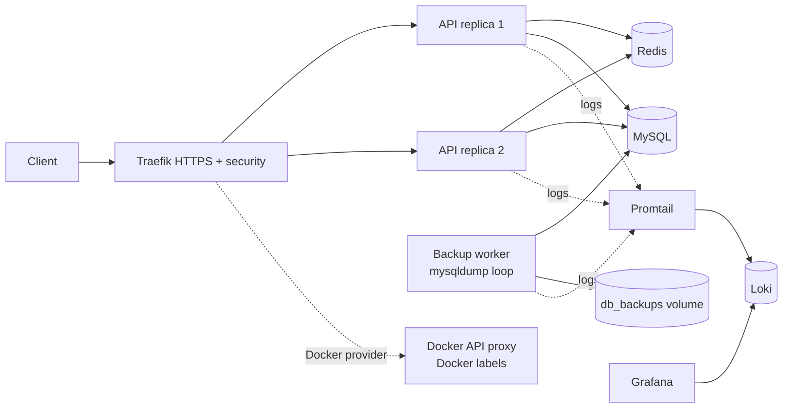
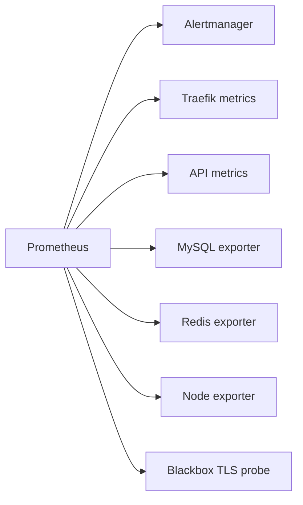

# 07 - Database backups

This stage adds automated database backups while keeping the previous logging and security layers.

Components:

- Backup worker creates timestamped MySQL dumps.
- Backup files are stored in a separate `db_backups` Docker volume.
- Loki stores logs.
- Promtail ships Docker logs to Loki.
- Grafana is preconfigured with Loki as a datasource.

Why a separate backup volume:

- It survives container replacement.
- It separates database runtime files from backup artifacts.
- It makes restore testing easier because backups are explicit SQL files.

## Current architecture



## What this proves

- MySQL backup automation runs as an independent container.
- Dumps are timestamped and saved outside the MySQL runtime volume.
- Backup and application logs are visible in centralized logging.

## Run

```bash
./scripts/generate-local-certs.sh
docker compose up -d --build --scale api=2 --wait
```

## Prove it

Run the automated check:

```bash
./scripts/check.sh
```
Traefik discovery proof:

```bash
curl http://localhost:8081/api/http/routers | grep '@docker'
docker compose exec traefik wget -q -O - http://docker-api-proxy:2375/v1.24/version
```


Manual backup proof:

```bash
# List generated dumps.
docker compose exec backup ls -lh /backups

# Inspect the newest dump content.
docker compose exec backup sh -lc 'latest="$(ls -1 /backups/appdb-*.sql | tail -1)"; echo "$latest"; grep -n "CREATE TABLE" "$latest" | head'

# Prove the backup volume is separate.
docker volume inspect task03_stage07_backups_db_backups
docker volume inspect task03_stage07_backups_mysql_data
```

Manual logging proof:

```bash
curl -k -H 'Host: api.localhost' -H 'X-API-Key: lab-secret-key' https://localhost:8443/api/items
curl -G http://localhost:3100/loki/api/v1/series \
  --data-urlencode 'match[]={project="task03_stage07_backups"}'
```

Grafana is available at `http://localhost:3300`.

## Next stage preview



Stage 08 keeps backups and logging, then adds Prometheus metrics and Alertmanager alerts.

## Stop

```bash
docker compose down -v
```
