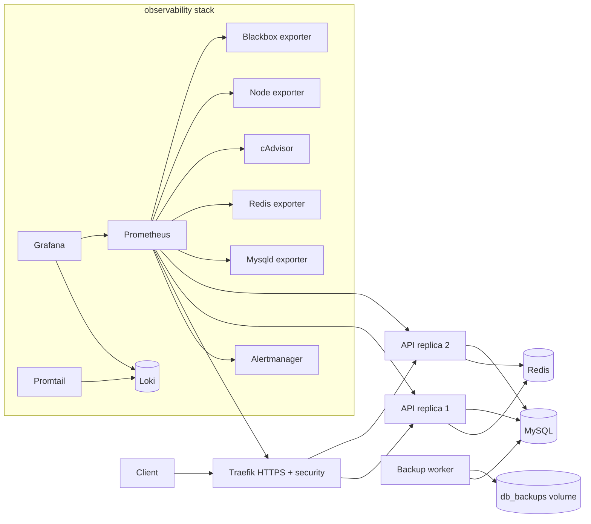
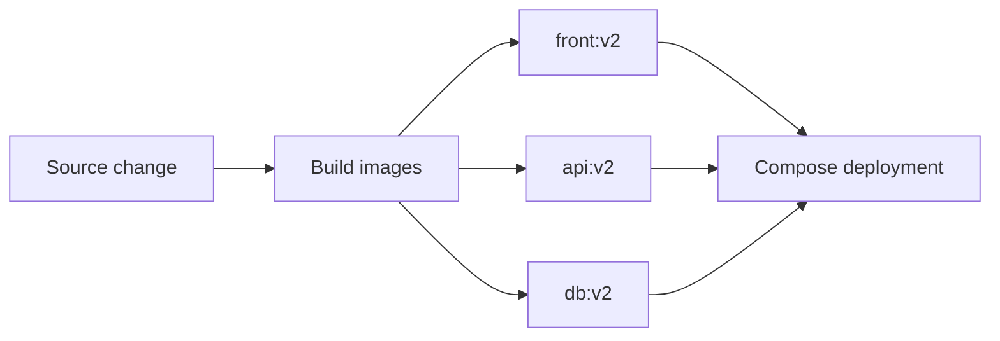

# 08 - Monitoring and alerting

This stage adds Prometheus monitoring and Alertmanager alerting while keeping the previous security, logging, and backup layers.

Components:

- Prometheus scrapes Traefik, API replicas, MySQL, Redis, cAdvisor, node-exporter, and blackbox exporter.
- Alertmanager receives Prometheus alerts.
- Blackbox exporter probes HTTPS and exposes certificate expiry metrics.
- Grafana has Loki and Prometheus datasources.
- Backup worker still creates timestamped MySQL dumps.

Alerts included:

- API p95 latency high.
- MySQL connection count high.
- Monitored target down.
- Host memory almost full.
- TLS certificate expires soon.

## Current architecture



## What this proves

- Metrics and logs are separate but both visible in Grafana.
- Prometheus knows every key component as a target.
- Alert rules are loaded for API latency, DB load, target health, memory pressure, and TLS expiry.
- HTTPS certificate probing works through blackbox exporter.

## Run

```bash
./scripts/generate-local-certs.sh
docker compose up -d --build --scale api=2 --wait
```

## Prove it

Run the automated check:

```bash
./scripts/check.sh
```

Manual monitoring proof:

```bash
# Prometheus and Alertmanager readiness.
curl http://localhost:9090/-/ready
curl http://localhost:9093/-/ready

# Inspect scrape targets.
curl http://localhost:9090/api/v1/targets

# Confirm alert rules are loaded.
curl http://localhost:9090/api/v1/rules | grep ApiP95LatencyHigh
curl http://localhost:9090/api/v1/rules | grep DatabaseConnectionsHigh
curl http://localhost:9090/api/v1/rules | grep SslCertificateExpiresSoon

# Probe HTTPS certificate expiry through blackbox exporter.
curl 'http://localhost:9115/probe?module=https_2xx_insecure&target=https://api.localhost:8443/api/items' | grep probe_ssl_earliest_cert_expiry
```

Trigger the API latency alert:

```bash
for i in $(seq 1 40); do
  curl -k -H 'Host: api.localhost' \
    -H 'X-API-Key: intern-secret-key' \
    'https://localhost:8443/api/slow?delay_ms=900'
done
```

Manual backup and logging proof:

```bash
docker compose exec backup ls -lh /backups
curl -G http://localhost:3100/loki/api/v1/series \
  --data-urlencode 'match[]={project="task03_stage08_alerting"}'
```

Open dashboards:

```bash
open http://localhost:9090
open http://localhost:9093
open http://localhost:3300
```

## Next stage preview



Stage 09 keeps the operational stack and adds explicit image versioning for the custom front-end, API, and database seed image.

## Stop

```bash
docker compose down -v
```
