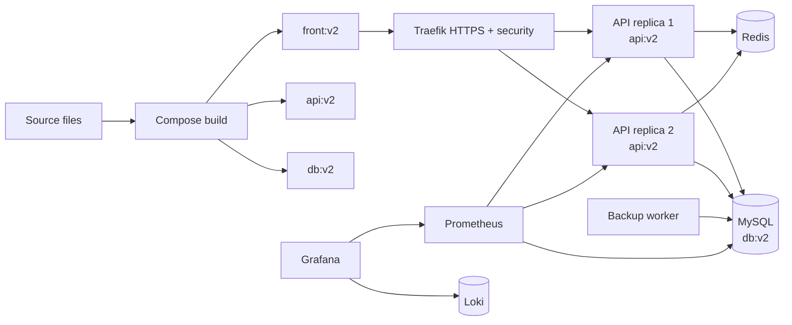
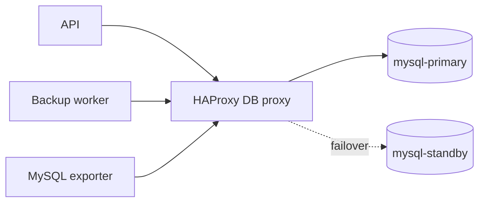

# 09 - Image versioning

This stage adds explicit image versioning while keeping the previous security, logging, backup, monitoring, and alerting layers.

Components:

- `front:v2` is built from `front/Dockerfile`.
- `api:v2` is built from `api/Dockerfile`.
- `db:v2` is built from `db/Dockerfile` and includes the seed SQL.
- Third-party images keep pinned upstream tags such as `traefik:v3.1`, `redis:7.4-alpine`, and `prom/prometheus:v2.54.1`.

Versioning rule for interns:

- Any application or schema change must create a new immutable tag.
- Example: change the API, then move from `api:v2` to `api:v3`.
- Do not reuse an existing tag for a different build in a real registry.

## Current architecture



## What this proves

- Custom application and database seed artifacts have visible tags.
- Compose uses the expected `front:v2`, `api:v2`, and `db:v2` images.
- The operational stack from the previous stages still works after introducing image tags.

## Run

```bash
./scripts/generate-local-certs.sh
docker compose up -d --build --scale api=2 --wait
```

## Prove it

Run the automated check:

```bash
./scripts/check.sh
```

Manual image proof:

```bash
# Inspect the built images.
docker image inspect front:v2 api:v2 db:v2

# Show the images declared by Compose.
docker compose config --images

# Show the containers using the versioned tags.
docker compose ps
```

Manual operational proof:

```bash
docker compose exec backup ls -lh /backups
curl http://localhost:9090/api/v1/targets
curl http://localhost:9090/api/v1/rules | grep ApiP95LatencyHigh
curl -G http://localhost:3100/loki/api/v1/series \
  --data-urlencode 'match[]={project="task03_stage09_versioning"}'
```

Trigger the API latency alert:

```bash
for i in $(seq 1 40); do
  curl -k -H 'Host: api.localhost' \
    -H 'X-API-Key: intern-secret-key' \
    'https://localhost:8443/api/slow?delay_ms=900'
done
```

Open dashboards:

```bash
open http://localhost:9090
open http://localhost:9093
open http://localhost:3300
```

## Next stage preview



Stage 10 keeps image versioning and adds a simple HAProxy database failover path.

## Stop

```bash
docker compose down -v
```
