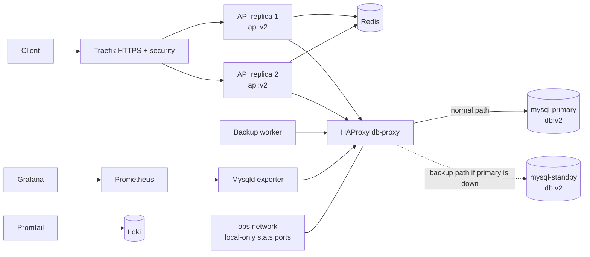
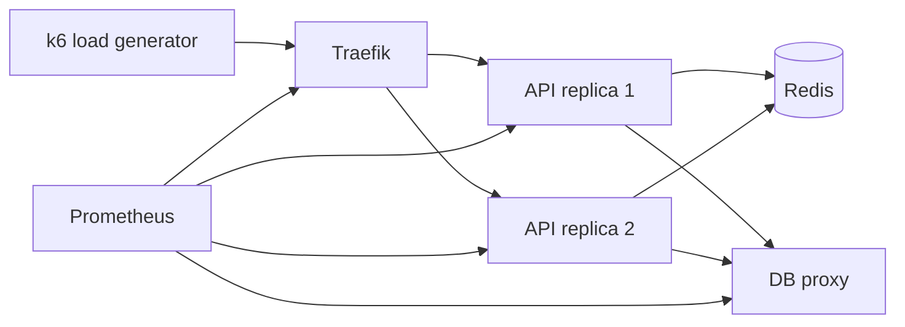

# 10 - Database failover

This stage adds simple database failover while keeping the previous security, logging, backup, monitoring, alerting, and image-versioning layers.

Components:

- `mysql-primary` is the normal database target.
- `mysql-standby` is marked as the backup target.
- `db-proxy` uses HAProxy TCP checks and switches to standby when primary fails.
- The API, backup worker, and MySQL exporter connect to `db-proxy`, not directly to a MySQL container.
- `db-proxy` also joins the non-public `ops` network so Docker can publish local-only teaching ports on `127.0.0.1:33060` and `127.0.0.1:8404`.

Important limitation:

This is routing failover, not full database high availability. The two MySQL containers are seeded with the same schema, but there is no replication. A production design would use MySQL replication, InnoDB Cluster, Galera, or a managed database service.

## Current architecture



## What this proves

- Database clients use a stable proxy endpoint instead of a specific MySQL container.
- HAProxy marks the primary down and serves from standby when the primary stops.
- API reads continue after primary failure when the cache is cleared.
- HAProxy stats expose the primary and standby state for lecture demonstration.

## Run

```bash
./scripts/generate-local-certs.sh
docker compose up -d --build --scale api=2 --wait
```

## Prove it

Run the automated check:

```bash
./scripts/check.sh
```

Manual failover proof:

```bash
# Confirm HAProxy sees both database backends.
curl 'http://localhost:8404/stats;csv' | grep '^mysql,mysql-'

# Force a database read through the proxy.
docker compose exec redis redis-cli DEL catalog:v1
curl -k -H 'Host: api.localhost' \
  -H 'X-API-Key: intern-secret-key' \
  https://localhost:8443/api/items

# Stop primary and wait for HAProxy health checks.
docker compose stop mysql-primary
sleep 12

# Clear Redis so the API must read from MySQL through db-proxy.
docker compose exec redis redis-cli DEL catalog:v1
curl -k -H 'Host: api.localhost' \
  -H 'X-API-Key: intern-secret-key' \
  https://localhost:8443/api/items

# HAProxy should show primary DOWN and standby UP.
curl 'http://localhost:8404/stats;csv' | grep '^mysql,mysql-'

# Restore primary after the demo.
docker compose start mysql-primary
```

HAProxy browser view:

```bash
open http://localhost:8404/stats
```

Manual operational proof:

```bash
docker image inspect front:v2 api:v2 db:v2
docker compose exec backup ls -lh /backups
curl http://localhost:9090/api/v1/targets
curl -G http://localhost:3100/loki/api/v1/series \
  --data-urlencode 'match[]={project="task03_stage10_failover"}'
```

## Next stage preview



Stage 11 keeps database failover and adds repeatable load testing with k6.

## Stop

```bash
docker compose down -v
```
