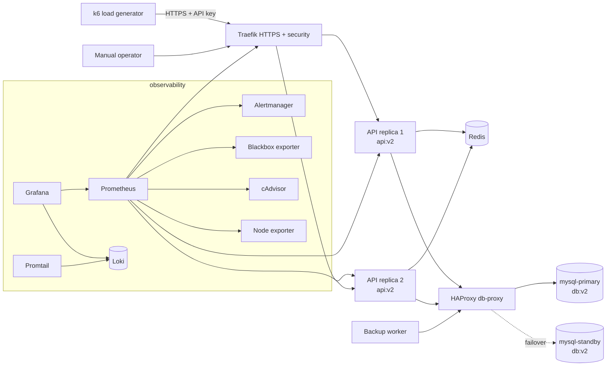
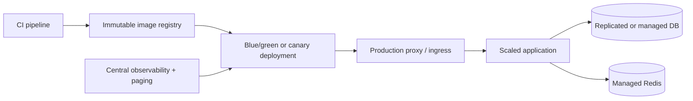

# 11 - Load testing

This stage adds load testing with k6 while keeping the previous security, logging, backup, monitoring, alerting, image-versioning, and database-failover layers.

Components:

- k6 sends HTTPS traffic through Traefik.
- The load test includes normal API reads, occasional cache clears, and occasional slow requests.
- Prometheus, Alertmanager, Grafana, Loki, Traefik, API replicas, MySQL, Redis, and HAProxy can be watched during the run.
- HAProxy local demo ports are bound to `127.0.0.1:33060` and `127.0.0.1:8404` through the non-public `ops` network.

Rate-limit note:

The API rate limit is higher in this stage than in stage 05. The goal here is to load the system, not to stop most requests at the proxy.

## Current architecture



## What this proves

- The full stack can be exercised under repeatable load.
- Load passes through HTTPS, API key auth, rate limiting, and Traefik load balancing.
- k6 thresholds verify that request failures and p95 latency stay inside the lab target.
- Monitoring, alerting, logging, SSL probing, backups, Redis, and DB failover remain available during load.

## Run

```bash
./scripts/generate-local-certs.sh
docker compose up -d --build --scale api=2 --wait
```

## Prove it

Run the automated check:

```bash
./scripts/check.sh
```

Manual load-test proof:

```bash
# Default load test: 25 VUs for 60 seconds.
docker compose run --rm k6 run /scripts/load-test.js

# Short lecture run.
docker compose run --rm -e K6_VUS=10 -e K6_DURATION=15s k6 run /scripts/load-test.js

# Heavier run for demonstration.
docker compose run --rm -e K6_VUS=50 -e K6_DURATION=60s k6 run /scripts/load-test.js
```

Manual failover proof:

```bash
docker compose exec redis redis-cli DEL catalog:v1
curl -k -H 'Host: api.localhost' -H 'X-API-Key: intern-secret-key' https://localhost:8443/api/items

docker compose stop mysql-primary
sleep 12
docker compose exec redis redis-cli DEL catalog:v1
curl -k -H 'Host: api.localhost' -H 'X-API-Key: intern-secret-key' https://localhost:8443/api/items
curl 'http://localhost:8404/stats;csv' | grep '^mysql,mysql-'
docker compose start mysql-primary
```

Manual observability proof:

```bash
docker image inspect front:v2 api:v2 db:v2
docker compose exec backup ls -lh /backups
curl http://localhost:9090/api/v1/targets
curl http://localhost:9090/api/v1/rules | grep ApiP95LatencyHigh
curl -G http://localhost:3100/loki/api/v1/series \
  --data-urlencode 'match[]={project="task03_stage11_loadtest"}'
```

Watch during the test:

```bash
open http://localhost:8081/dashboard/
open http://localhost:9090
open http://localhost:9093
open http://localhost:3300
open http://localhost:8404/stats
```

## Production hardening preview



After this lab, the next production-grade steps would be CI-built immutable images, real DNS and ACME certificates, replicated database storage, off-host backup retention, secret management, and blue/green or canary deployment workflows.

## Stop

```bash
docker compose down -v
```
